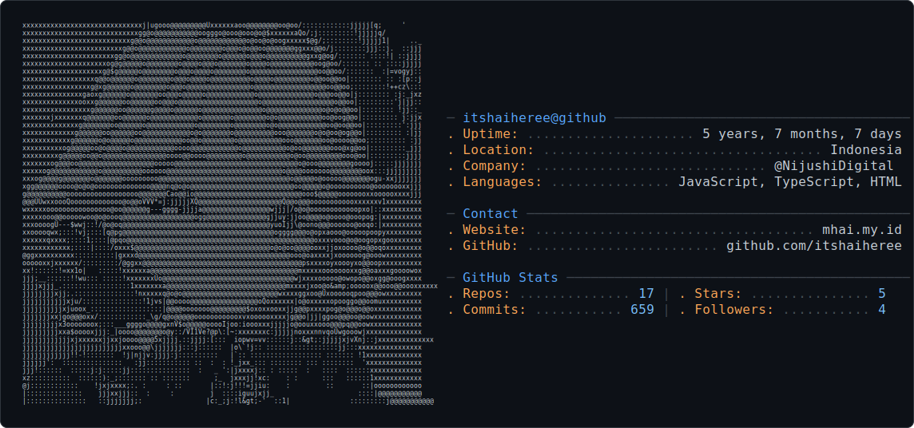

<h2>👋 Hi there!</h2><h3>I'm Muhammad Haikal Ali Abdillah!</h3>You can call me <b>"Haikal"</b> (also <b>"Hai"</b>)  Just an ordinary kid from Indonesia who loves code and her :3

 

<h2>⭐ Current Project</h2>
<a href="https://github.com/itshaiheree/tahun-baru-countdown"><picture><source media="(prefers-color-scheme: dark)" srcset="https://gituweh.vercel.app/api/pin?username=itshaiheree&repo=tahun-baru-countdown&show_owner=true&theme=dark"><source media="(prefers-color-scheme: light)" srcset="https://gituweh.vercel.app/api/pin?username=itshaiheree&repo=tahun-baru-countdown&show_owner=true&theme=default"></picture></a>
Here is the project i'm working on right now 
(but i'm not sure i'll do regular updates on it XD)

 

### 📊 My Github Stats

&nbsp;&nbsp;&nbsp;&nbsp;&nbsp;&nbsp;&nbsp;&nbsp;
<picture>
  <source media="(prefers-color-scheme: dark)" srcset="dark_mode.svg" />
  <source media="(prefers-color-scheme: light)" srcset="light_mode.svg" />
  
</picture>

### 🔗 Links

&nbsp;&nbsp;
&nbsp;&nbsp;
&nbsp;&nbsp;
&nbsp;&nbsp;
[-@mieayampwangsit-000000?style=flat&logo=x&logoColor=white)](https://x.com/mieayampwangsit)&nbsp;&nbsp;
&nbsp;&nbsp;

<h2>🤍 Thanks for visiting my profile!</h2>
Let's have a connection! Contact me via email at <a href="mailto:hello@mhai.my.id">hello@mhai.my.id</a> if you interested

 

